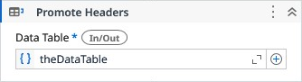

# Promote Headers

Promotes the first row of values to new column headers.

### Properties

| Name | Description | Required |
|------|-------------|----------|
| Data Table | The data table which first row will be promoted to headers. | ✓ |
| Auto Rename | When true, adds a numeric suffix if the column name is already present in the Data Table. |  |

