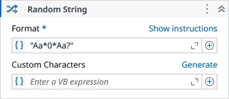

# Random String

Generates a random string based on a format pattern.

### Properties

| Name | Description | Required |
|------|-------------|----------|
| Format | Pattern that defines the generated string. Placeholders: 'a' lowercase, 'A' uppercase, '0' digit, '*' any alphanumeric, '?' custom characters, '\\' escape. | ✓ |
| Custom Characters | Additional characters used when the '?' placeholder is present. |  |
| Result | The generated random string. |  |

