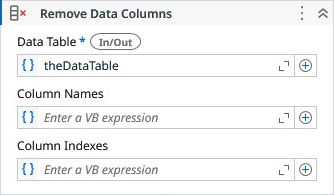

# Remove Data Columns

Removes the specified columns from a Data Table

### Properties

| Name | Description | Required |
|------|-------------|----------|
| Data Table | The Data Table from which the columns is to be removed. | ✓ |
| Column Names | The column names to be removed. |  |
| Column Indexes | The column indexes to be removed. |  |

