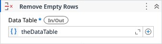

# Remove Empty Rows

Removes the empty rows from a Data Table.

### Properties

| Name | Description | Required |
|------|-------------|----------|
| Data Table | The Data Table whose empty rows will be removed. | ✓ |
| Column Names | Column names to evaluate. Can be combined with Column Indexes. If not specified, all columns are considered. |  |
| Column Indexes | Column indexes to evaluate. Can be combined with Column Names. If not specified, all columns are considered. |  |
| Matching Mode | Determines how a row is evaluated for removal: All — the row is removed if all specified columns are empty. Any — the row is removed if any specified column is empty. If no columns are specified, all columns of the Data Table are considered. |  |

