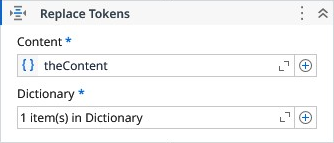

# Replace Tokens

Replaces the tokens of a string by the values of a Dictionary. Tokens are strings written in a specific pattern, usually enclosed in special characters. Use the combination of 'Pattern' and 'Placeholder' properties to define your token format.

### Properties

| Name | Description | Required |
|------|-------------|----------|
| Content | The input text where tokens will be replaced. | ✓ |
| Dictionary | The dictionary where each key/value pair are used to replace the tokens. | ✓ |
| Pattern | The token text pattern. It can have characters either before and after the placeholder. | ✓ |
| Placeholder | The character used as the placeholder inside the token pattern. | ✓ |
| Case Sensitive | Determines if the searching for tokens are case sensitive. The Pattern is also affected. |  |
| Result |  The resulting text after all tokens have been replaced. |  |

