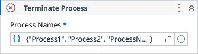

# Terminate Process

Tries to gracefully close all instances of the applications corresponding to the specified processes. If not possible, it kills the process for the current user session.

### Properties

| Name | Description | Required |
|------|-------------|----------|
| Process Names | The list of names of the processes to be terminated. | ✓ |

