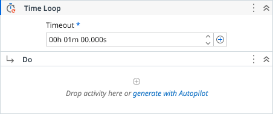

# Time Loop

Repeats the body activities until the timeout expires, with optional iteration intervals and index tracking. Returns true if the loop ended due to timeout.

### Properties

| Name | Description | Required |
|------|-------------|----------|
| Timeout | Defines how long the loop runs. The timeout is checked after each iteration, and ongoing iterations are not interrupted. | ✓ |
| Interval | The interval in seconds to wait before the next loop. |  |
| Index | The current iteration (zero-based) that is being processed. |  |
| Result | Indicates whether the loop ended due to timeout (true) or was interrupted earlier (false). |  |

