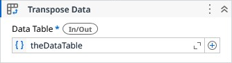

# Transpose Data

Transposes a DataTable by turning rows into columns and columns into rows. New column names are automatically generated (Col1, Col2, …) to avoid duplicates.

### Properties

| Name | Description | Required |
|------|-------------|----------|
| Data Table | The Data Table to be transposed. | ✓ |

