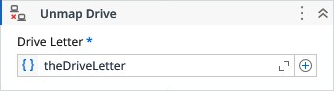

# Unmap Drive

Removes a mapped network drive from the system.

### Properties

| Name | Description | Required |
|------|-------------|----------|
| Drive Letter | Specifies the drive letter of the mapped drive to be unmapped. The required format is <letter><colon>, for example: "X:", "y:", "Z:". | ✓ |
| Response Code | Represents the return code of the drive mapping operation. This value indicates whether the operation succeeded or failed, according to the standard Windows error codes. |  |
| Response Message | Provides the textual description corresponding to the response code. This message explains the result of the operation in a human‑readable format. |  |
| Result | Returns true if the drive was successfully unmapped, false otherise. |  |

