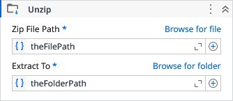

# Unzip

Extracts files and folders from a zip archive.

### Properties

| Name | Description | Required |
|------|-------------|----------|
| Zip File Path | The path to the zip archive to extract. | ✓ |
| Extract To | The folder where the archive contents will be extracted. | ✓ |
| Overwrite | If true, existing files will be overwritten during extraction. |  |

