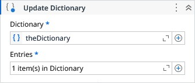

# Update Dictionary

Adds or updates an entry in the Dictionary.

### Properties

| Name | Description | Required |
|------|-------------|----------|
| Dictionary | The Dictionary instance to be updated. | ✓ |
| Entries | The entries to be added or updated to the dictionary | ✓ |

