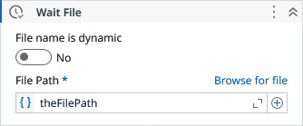

# Wait File

Waits until the file be available.

### Properties

| Name | Description | Required |
|------|-------------|----------|
| Continue on error | Specifies to continue executing the remaining activities even if the current activity failed. Only boolean values are allowed. |  |
| Timeout | Specifies the amount of time in seconds to wait for the activity to complete before an error is thrown. The default value is 30 seconds. Any value less than or equal to zero will be reset to 30. |  |
| File Path | The path to the file. |  |
| Interval | Specifies the amount of time in seconds for the file re-check. Any value less than 0.5 will be clamped to 0.5. Make sure to keep this value lesser than Timeout value. |  |
| Wait For Exist | Waits until the file exists. |  |
| Directory Path | Directory path to be monitored. |  |
| Search Pattern | The search string defines file name patterns in the path. It supports literal text and wildcards (*, ?, !, \|), but not regular expressions. Use ! for exclusions (e.g., !*.txt), and \| for multiple patterns (e.g., *.png\|*.gif\|*.jpeg). Default is *.* (all files). |  |
| File name is dynamic | When true, the behavior of the activity changes to monitor a specific folder until find a file that corresponds to the search pattern informed. |  |
| Result | The FileInfo object of the respective file when found. |  |

