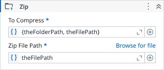

# Zip

Compresses files and folders into a zip archive.

### Properties

| Name | Description | Required |
|------|-------------|----------|
| Zip File Path | Path where the zip archive will be created. | ✓ |
| To Compress | Collection of file and directory paths to compress. | ✓ |
| Text Encoding | Encoding used for entry names inside the zip archive. |  |
| Compression Level | Compression level used when creating the archive. |  |
| Entry Structure | Defines how files are stored inside the ZIP archive: keep relative paths, flatten to root, rename duplicates, or preserve full directory structure. Auto mode flattens when possible and falls back to relative paths if duplicate names are detected. |  |
| Compressed File | Index or identifier of the compressed file created (when applicable). |  |
| Files Count | The number of files added to the archive. |  |

